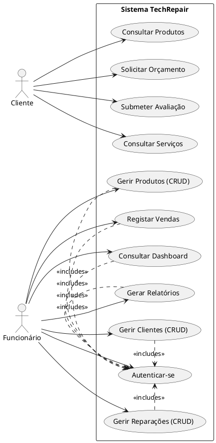
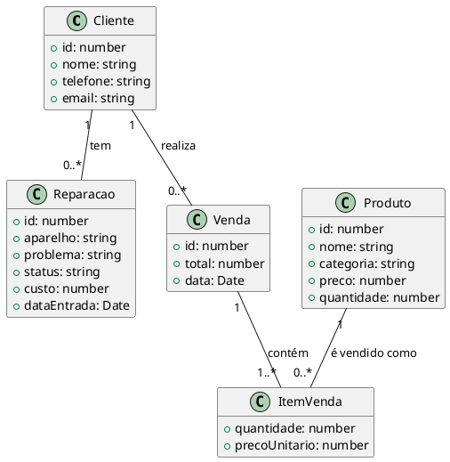

Este documento detalha a análise, concepção e estrutura técnica do sistema de gestão para a loja de reparações "TechRepair".

## **Parte I: Análise e Concepção**

### **1. A Organização e os Processos a Melhorar**

#### **A Organização**
O projeto foca-se numa pequena ou média empresa de reparação de dispositivos eletrónicos, aqui designada "TechRepair". Atualmente, a sua operação depende de processos manuais ou semi-digitais (ex: folhas de cálculo, anotações em papel, aplicações de mensagens), que são propensos a erros e não escalam com o crescimento do negócio.

#### **Processos a Melhorar**
O sistema proposto visa digitalizar e otimizar os seguintes processos:

- **Gestão de Clientes:**
  - *Antes:* O registo de informações dos clientes é desorganizado, dificultando o acesso ao histórico e o contacto.
  - *Depois:* Um sistema de CRM (Customer Relationship Management) centralizado onde cada cliente tem um perfil com os seus dados, histórico de reparações e compras.

- **Acompanhamento de Reparações:**
  - *Antes:* O controlo do estado de cada reparação (pendente, em curso, concluído) é feito de forma informal, levando a perdas de informação e atrasos na comunicação com o cliente.
  - *Depois:* Um módulo de gestão de reparações que acompanha todo o ciclo de vida do serviço, permitindo atualizações de estado e registo de custos.

- **Gestão de Inventário:**
  - *Antes:* Não há um controlo de stock em tempo real para peças e acessórios, resultando em falta de produtos ou compras desnecessárias.
  - *Depois:* Um sistema de gestão de produtos que controla as quantidades em stock, alertando para níveis baixos.

- **Processo de Venda:**
  - *Antes:* As vendas são registadas manualmente em cadernos ou folhas de cálculo, dificultando a análise de faturação.
  - *Depois:* Um módulo de Ponto de Venda (PDV) simplificado para registar vendas de produtos, que atualiza automaticamente o stock e contribui para os relatórios de faturação.

- **Presença Online e Angariação de Clientes:**
  - *Antes:* A loja não possui um canal online para divulgar serviços, vender produtos ou permitir que clientes peçam orçamentos.
  - *Depois:* Um site público que serve como montra digital, fortalece a marca e funciona como um canal de comunicação e captação de clientes.

- **Análise de Negócio:**
  - *Antes:* A ausência de dados centralizados impede a criação de relatórios e a análise de indicadores de desempenho (KPIs).
  - *Depois:* Um dashboard visual e um módulo de relatórios que fornecem insights sobre o desempenho da loja (vendas, reparações, clientes mais rentáveis, etc.).

### **2. Identificação do Problema e Esboço da Solução**

- **Problema Central:** A dependência de processos manuais e descentralizados resulta em **ineficiência operacional, falhas na comunicação com o cliente, perda de oportunidades de venda e dificuldade na gestão estratégica do negócio.**

- **Esboço da Solução:** A solução proposta é uma **Aplicação Web Integrada**, que aborda o problema em duas frentes distintas mas conectadas:

  1.  **Sistema de Gestão Interno (Back-office):** Uma área privada e segura para os funcionários, acessível via login, que centraliza todas as operações da loja.
      - **Módulos:** Dashboard, Gestão de Clientes, Gestão de Reparações, Gestão de Produtos (Stock), Registo de Vendas e Geração de Relatórios.
      - **Benefício:** Otimiza o fluxo de trabalho, reduz erros humanos, automatiza tarefas e fornece uma visão clara da saúde do negócio para a tomada de decisões.

  2.  **Site Público (Front-office):** Um website profissional e atrativo para o público geral, que serve como a "cara" da empresa na internet.
      - **Páginas:** Home, Serviços, Produtos, Sobre Nós, Contato (com pedido de orçamento) e Avaliações.
      - **Benefício:** Fortalece a marca, gera confiança, atrai novos clientes, melhora a comunicação e serve como um canal de vendas e suporte primário.

## **Parte II: Documentação Técnica**

### **3. Diagramas UML**

*(Nota: Os diagramas são representados em formato textual. Ferramentas como PlantUML ou Mermaid podem ser usadas para gerar as imagens correspondentes a partir deste código.)*

#### **3.1. Diagrama de Casos de Uso (Use Case)**

Este diagrama ilustra as interações dos utilizadores (atores) com o sistema.

#### **3.2. Diagrama de Classes (Simplificado)**

Este diagrama modela as principais entidades do sistema e as suas relações, com base nos tipos definidos em `src/types/index.ts`.

### **4. Construção de Telas (Frontend)**

Este requisito **já foi cumprido** no âmbito do desenvolvimento do projeto. A aplicação existente no diretório `src/` é uma interface de utilizador funcional e interativa.

- **Framework/Tecnologias:**
  - **Framework Principal:** **React (v18+)** com TypeScript
  - **Roteamento:** **React Router DOM** para navegação entre páginas.
  - **Estilização:** **Tailwind CSS**, uma framework *utility-first* para a criação de interfaces modernas e responsivas.
  - **Ferramenta de Build:** **Vite**, que proporciona um ambiente de desenvolvimento extremamente rápido.

- **Telas Implementadas:**
  As telas foram desenvolvidas como componentes reutilizáveis e estão organizadas da seguinte forma:

  - **Telas do Sistema Interno (`src/pages/loja/`):**
    - `Login.tsx`: Página de autenticação.
    - `Dashboard.tsx`: Visão geral com KPIs e atividades recentes.
    - `Clientes.tsx`: Listagem e gestão de clientes.
    - `ClienteDetalhes.tsx`: Visão detalhada de um cliente com seu histórico.
    - `Reparacoes.tsx`: Listagem e gestão de reparações.
    - `Produtos.tsx`: Listagem e gestão de produtos e stock.
    - `Vendas.tsx`: Listagem do histórico de vendas.
    - `Relatorios.tsx`: Página para visualização de gráficos e dados de desempenho.

  - **Telas do Site Público (`src/pages/cliente/`):**
    - `Home.tsx`: Página inicial de apresentação.
    - `Servicos.tsx`: Descrição dos serviços oferecidos.
    - `Produtos.tsx`: Catálogo de produtos para o cliente.
    - `Contato.tsx`: Formulário de contato e pedido de orçamento.
    * `Avaliacoes.tsx`: Mural de avaliações de clientes.
    - `Sobre.tsx`: Página com a história e valores da empresa.

  - **Componentes Reutilizáveis (`src/pages/components/`):**
    - Inclui formulários (`ClienteForm`, `ProductForm`, etc.), tabelas (`DataTable`), cartões (`ProductCard`, `ServiceCard`), barras de navegação (`Navbar`), rodapés (`Footer`) e outros elementos que compõem as telas de forma consistente.
